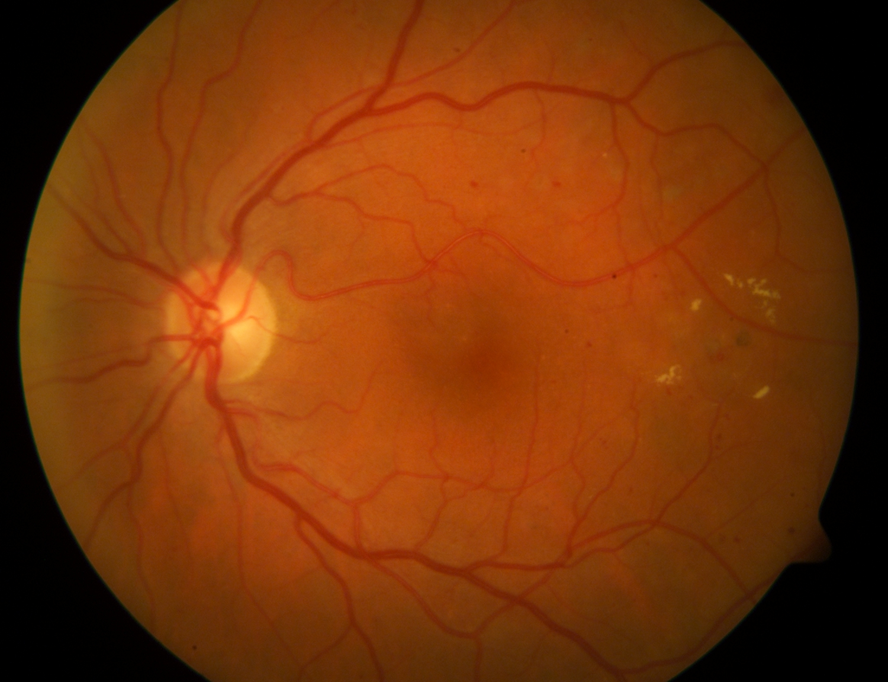

# Automatic Detection of Hard Exudates in Retinal Images with Diabetic Retinopathy  
Code for [Automatic Detection of Hard Exudates in Retinal Images with Diabetic Retinopathy](https://ieeexplore.ieee.org/abstract/document/8575566).

## Introduction  
The Diabetic Retinopathy (DR) is a visual complication of diabetes and one of the principal cause of lost vision not recov- erable in industrialized countries. The patients with DR do not perceive any symptoms until the visual loss develops in advanced stages when the treatment is less efficient. Hard exudates are the most common lesions in the early stages. In this work, we developed an automatic method for hard exudates detection in DR images with an acceptable level of confidence that can help specialists in the diagnosis and screening of this disease.

## Preprocessing  
          

## Segmentation of Hard Exudates Regions  
  

## Optical Disk Detection  
  

## Results  
  
